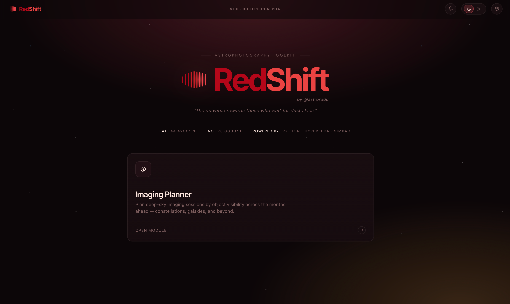
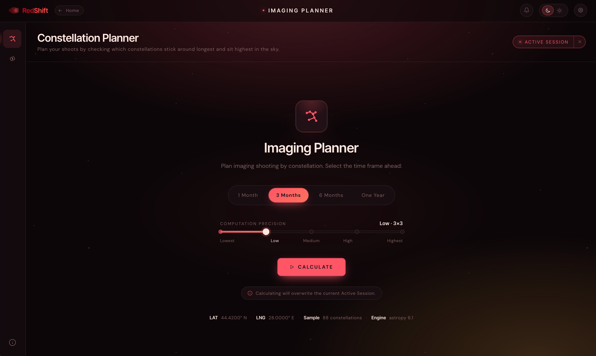
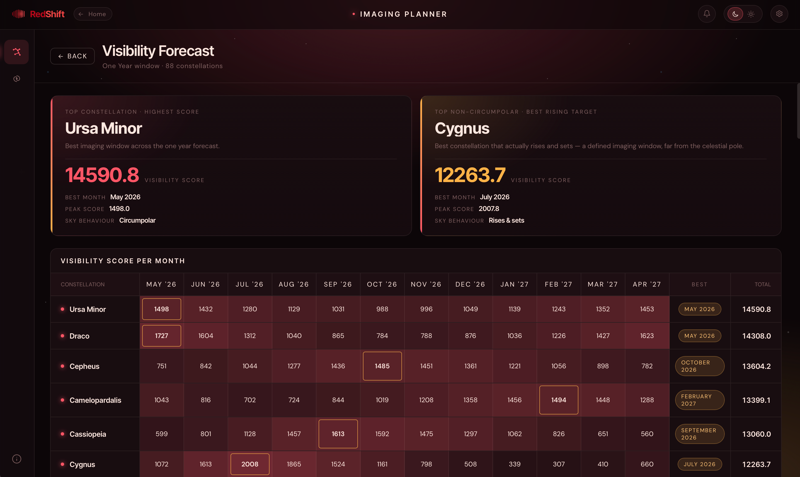
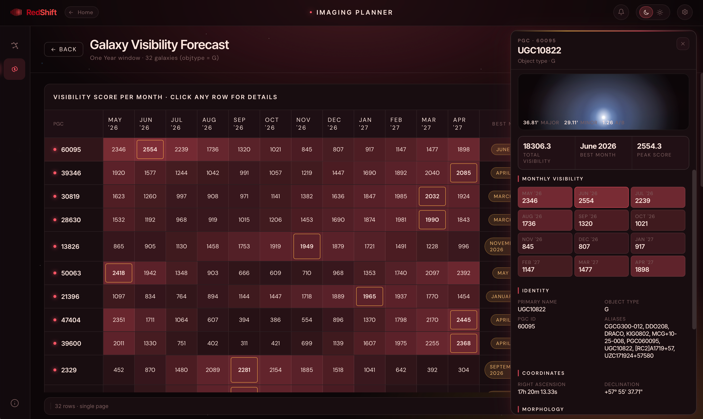

# RedShift

**A quiet workshop for the night sky.**

Plan your astrophotography sessions with precision — score every constellation and thousands of PGC galaxies by visibility, right from your observing site.

---

  

---

## Overview

RedShift is a desktop toolkit for **planning astrophotography sessions**. It takes your observing site, looks at where every target is in the sky over the next weeks or months, and tells you when and how long each one will be high enough to image.

> RedShift focuses on **session planning**, not capture or post-processing. Only the **Imaging Planner** is fully functional today — the other module tiles are reserved for future work.

---

## Tech Stack

 

RedShift is a **Tauri 2** native desktop app with a **React 18 + TypeScript** frontend and a bundled **Python 3.12 + FastAPI** sidecar. The Rust shell owns the native window, spawns and supervises the sidecar, and exposes exactly one system-level integration (CoreLocation on macOS). All application logic runs in the Python backend over authenticated HTTP on loopback — which means real computation scripts can plug in by replacing service implementations without touching the frontend.

No third-party UI kit is used. Every component is hand-rolled with a custom CSS variable design system, built for dark observing conditions.

---

## Modules

| # | Module | Status | Description |
|---|--------|:------:|-------------|
| 01 | **Image Stacker** | Mock | Align and integrate light frames — layers panel, σ-clip stats, live merge progress. |
| 02 | **Star Tracker** | Placeholder | Plate-solve and lock onto guide stars. |
| 03 | **Imaging Planner** | **Implemented** | Score all 88 IAU constellations and thousands of PGC galaxies by visibility. Backed by real `astropy` / `astroplan` computation. |
| 04 | **Telescope Control** | Placeholder | Slew, focus, rotate connected mounts. |
| 05 | **Dark Frame Analyzer** | Placeholder | Sensor noise, hot-pixel and thermal inspection. |

---

## Imaging Planner

The Imaging Planner has two tools: the **Constellation Planner** and the **Galaxy Planner**.

---

### Constellation Planner

Ranks all **88 IAU constellations** by visibility across your chosen window, calculated against your exact observing coordinates.

**Time frame** — 1 Month, 3 Months, 6 Months, or One Year. Default is *3 Months*.

**Computation precision** — a 5-step slider from *Lowest* to *Highest*, controlling how densely the engine samples each night and month. *Low* is the default and is usually fine.

#### Results

  

At the top, **hero cards** surface your best target — and a second card for the best target with a defined rising window when the top result stays fixed in the sky all night.

Below, a **heatmap table** shows every constellation with one cell per month, colored by score. Sort by any column; switch between *Heatmap*, *Numbers*, and *Sparkline* views.

  

---

### Galaxy Planner

Runs the same calculations against the **PGC large-galaxy catalogue** — thousands of entries with morphology, photometry, and angular size.

**Angular size filter** — pre-filter the catalogue before scoring: All, >3′, >8′, >12′, or >18′. Filtering makes runs significantly faster.

**Computation precision** — a 3-step slider: *Standard*, *High*, *Maximum*.

**Compute non-standard galactic types** — off by default. Enable to include non-confirmed entries alongside standard galaxies.

#### Results

  

A **paginated heatmap table** (100 rows per page) with per-month scores, best month, total, and full catalogue metadata. Click any row to open a detail popup. Results for each combination of settings are cached for the session — switching between them is instant.

---

## Reading the Visibility Score

The score is a unitless measure of **usable dark-sky time** for a target across the sampled timestamps. Higher is better. Compare scores within the same run — absolute numbers vary by precision setting.

The **Best Month** column shows when a target peaks; **Total** is the cumulative score across the window. Switch to *Numbers* for raw values or *Sparkline* to see the visibility curve shape at a glance.

> Treat the score as a **filter, not a verdict**. It tells you what's visible — not what's worth shooting. Object size, brightness, and light pollution are yours to weigh.

---

## Setting Your Location

Every calculation needs your **latitude and longitude**. Open **Settings** from the top-right gear icon.

**System location (macOS)** — click **Get System Location** for a one-tap coarse fix via CoreLocation.

**Manual entry** — type decimal degrees into the Latitude and Longitude fields and click **Save**. Latitude range: `-90` to `90`; longitude: `-180` to `180`.

Once set, your coordinates appear in the header strip of every planner start screen.

---

## Appearance

**Dark and light mode** — toggle from the top-right sun/moon icon or from Settings. The whole UI flips instantly.

**Palettes** — seven hand-tuned color palettes, each in dark and light: Aurora, Nebula, Mars, Ember, Verdant, Monochrome, and Solar. Preview them in the Settings grid; your choice is remembered across restarts.

---

## Download

Pre-built binaries for macOS are available on the [**Releases**](https://github.com/astroradu/RedShift/releases) page.

| Platform | Format |
|----------|--------|
| macOS | `.dmg` |

---

*RedShift — source available. See [LICENSE](LICENSE) for terms.*

